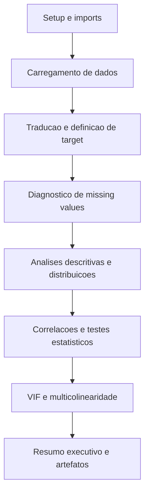

# Analise exploratoria do notebook 01_exploratory_analysis_improved.ipynb

Este documento explica, de forma didatica e objetiva, cada subsecao do notebook `01_exploratory_analysis_improved.ipynb`. O foco e descrever o que foi feito, por que foi feito e como interpretar cada analise.

## Diagrama de Blocos

## 1. Setup e Importacoes

- Define caminhos do projeto com `get_project_root()` procurando a pasta `data` em diretorios acima do `cwd`. Isso torna o notebook portavel.
- Declara caminhos padrao para dados (`00_data/raw`, `00_data/processed`), modelos (`03_models/trained`, `03_models/final`) e resultados (`04_reports`).
- Adiciona `08_src/` ao `sys.path` para permitir importar modulos customizados do projeto.
- Importa bibliotecas principais: `pandas`, `numpy`, `matplotlib`, `seaborn` e pacotes estatisticos (Mann-Whitney, Chi-quadrado, VIF).
- Tenta carregar Plotly para graficos interativos; se nao estiver disponivel, usa Matplotlib/Seaborn.
- Tenta importar `utils.helpers` e `utils.config`. Se falhar, cria funcoes fallback:
  - `print_section()` para formatar secoes no terminal.
  - `save_figure()` para salvar figuras em `04_reports/`.
  - `setup_plotting_style()` para padronizar estilo grafico.
- Ajusta o estilo dos graficos e define `PLOT_STYLE` com tamanho, dpi e paleta de cores.

## 2. Carregamento de Dados

### 2.1 Carregamento do Dataset do Kaggle

- Define a URL do Kaggle para referencia.
- Procura o arquivo `Hypertension-risk-model-main.csv` em caminhos possiveis (pasta `00_data/raw` do projeto e diretorios acima).
- Se encontrar o arquivo, carrega em `df_kaggle`, mostra dimensoes, lista de colunas e primeiras linhas, e copia para `df`.
- Se nao encontrar, imprime instrucoes de download e cria um dataset sintetico com 4.240 amostras. As variaveis sinteticas imitam distribuicoes realistas (exponencial, normal, binomiais) e permitem rodar o notebook sem o arquivo real.

### 2.2 Traducao e padronizacao de colunas

- Usa um dicionario de traducao para renomear colunas do ingles para o portugues (ex.: `age -> idade`, `sysBP -> pressao_sistolica`).
- Mantem o nome original quando nao ha traducao definida.
- Mostra o mapeamento `origem -> destino` e a lista final de colunas.
- Identifica automaticamente a coluna target (prioridade: `risco_hipertensao`, `Risk`, `TenYearCHD`).

### 2.3 Verificacao final dos dados

- Garante que `df` exista; se nao existir, cria dados sinteticos em portugues e injeta valores ausentes artificiais para testar a analise de missing values.
- Define a coluna target caso ainda nao esteja identificada.
- Exibe um resumo do dataset: dimensoes, target e numero de colunas numericas.

## 3. Visao Geral dos Dados

- Imprime dimensoes, uso de memoria e timestamp da analise.
- Mostra as primeiras linhas (`head`) para inspecionar estrutura.
- Usa `df.info()` para tipos de dados e contagem de valores nao nulos.
- Exibe estatisticas descritivas (`describe`) para variaveis numericas.
- Caso existam variaveis categoricas (tipo `object` ou `category`), exibe estatisticas descritivas delas tambem.

## 4. Analise de Valores Ausentes

### 4.1 Diagnostico de missing values

- Calcula, para cada coluna, quantidade e percentual de valores ausentes.
- Exibe uma tabela ordenada por percentual de missing.
- Gera grafico horizontal com percentual de ausentes por variavel (salvo em `04_reports/eda/missing_values_analysis.png`).

### 4.2 Tratamento de valores ausentes (implementado)

- Cria `df_treated` como copia do `df` para nao alterar os dados originais.
- Avalia o padrao de missing por grupo de risco (baixo vs alto) e classifica como `balanced` ou `imbalanced`.
- Estrategia especifica implementada:
  - **Glicose**: imputacao pela mediana estratificada por grupo de risco e faixa etaria (Jovem, Meia-idade, Idoso).
  - A abordagem reduz vies ao respeitar diferencas demograficas e clinicas.
- A coluna auxiliar `idade_grupo` e removida apos o processo.

## 5. Analise da Variavel Target

- Confirma (ou redefine) a coluna target.
- Calcula distribuicao de classes e percentuais (baixo risco vs alto risco).
- Mede a razao de desbalanceamento (`max/min`).
  - Se > 2, recomenda tecnicas como SMOTE.
- Visualizacoes:
  - Grafico de barras com contagem e percentual por classe.
  - Grafico de pizza com proporcao das classes.
- Salva a figura em `04_reports/eda/target_distribution.png`.

## 6. Distribuicoes das Variaveis Numericas

### 6.1 Identificacao de variaveis numericas

- Separa colunas numericas e remove a target.
- Usa um limiar de unicidade (`<= 10`) para classificar variaveis como:
  - **Categoricas numericas** (ex.: 0/1).
  - **Continuas** (distribuicoes reais/continuas).

### 6.2 Variaveis continuas (visualizacao 2x4)

- Plota ate 8 variaveis continuas em subplots 2x4.
- Para cada variavel:
  - Histogramas sobrepostos por grupo de risco (baixa/alta).
  - Linhas verticais mostrando medias de cada grupo.
  - Teste Mann-Whitney U para diferenca de distribuicoes.
  - Calculo de Cohen's d para tamanho de efeito.
- Salva a figura em `04_reports/eda/continuous_distributions.png`.

### 6.3 Boxplots das variaveis continuas

- Boxplots por grupo de risco para as mesmas variaveis.
- Calcula e sinaliza percentual de outliers (IQR). Se > 5%, destaca no grafico.
- Salva a figura em `04_reports/eda/continuous_boxplots.png`.

### 6.4 Resumo estatistico das diferencas

- Reaplica Mann-Whitney U em cada variavel continua analisada.
- Lista variaveis com p-value < 0.05 e resume direcao e magnitude da diferenca.

### 6.5 Variaveis categoricas (visualizacao 2x2)

- Plota ate 4 variaveis categoricas em subplots 2x2.
- Usa `pd.crosstab` normalizado por coluna para comparar proporcoes entre grupos de risco.
- Aplica teste qui-quadrado (`chi2_contingency`) para associacao entre variavel e target.
- Adiciona p-value e estatistica chi-quadrado nos graficos.
- Salva a figura em `04_reports/eda/categorical_distributions.png`.
- Faz interpretacao simples quando a variavel e binaria (diferen?a de risco entre categoria 0 e 1).

## 7. Analise de Outliers

- A secao existe como placeholder, mas nao ha codigo executado nela. A analise de outliers ocorre indiretamente nos boxplots da secao 6.

## 8. Analise de Correlacoes

- Calcula matriz de correlacao para variaveis numericas.
- Exibe um heatmap triangular com anotacoes dos coeficientes.
- Salva o grafico em `04_reports/eda/correlation_matrix.png`.
- Lista correlacoes com a variavel target, indicando direcao (positiva/negativa) e intensidade (fraca, moderada, forte).

## 9. Analise Estatistica Comparativa Aprofundada

### 9.1 Funcao `analise_estatistica_completa`

- Compara grupos sem risco vs com risco para todas as variaveis numericas.
- Para cada variavel:
  - Remove missing values.
  - Aplica **Mann-Whitney U** (nao parametricos).
  - Calcula medias, desvios e diferenca percentual.
  - Calcula **Cohen's d** (tamanho do efeito) e classifica em: Desprezivel, Pequeno, Medio, Grande.
- Ordena resultados por p-value.
- Exibe uma tabela com principais metricas e lista as variaveis significativas.
- Destaca as top variaveis mais discriminantes com direcao e efeito.
- Resume a distribuicao dos tamanhos de efeito.

### 9.2 Visualizacao dos testes estatisticos

- Para as variaveis significativas (top 10):
  - Grafico horizontal de Cohen's d (com limiares de efeito pequeno, medio e grande).
  - Grafico horizontal de `-log10(p-value)` com referencias de p=0.05 e p=0.01.
- Salva a figura em `04_reports/eda/statistical_tests_results.png`.
- Inclui interpretacao textual do que significa cada grafico.

## 10. Analise de Multicolinearidade (VIF)

- Calcula **VIF (Variance Inflation Factor)** somente para variaveis continuas.
- Remove valores ausentes antes de calcular.
- Classifica os VIFs:
  - < 5: aceitavel
  - 5-10: moderado
  - > 10: alto (possivel redundancia)
- Resume quantas features estao em cada faixa e recomenda:
  - Remover variaveis redundantes ou aplicar PCA.
- Visualiza os VIFs em grafico horizontal com cores por nivel e linhas de referencia (5 e 10).
- Salva a figura em `04_reports/eda/vif_analysis.png`.

## 11. Resumo Executivo

- Imprime um resumo automatico com:
  - Tamanho do dataset e quantidade de variaveis.
  - Distribuicao da target.
  - Quantidade de variaveis estatisticamente significativas.
  - Status de multicolinearidade (VIF).
- Fornece recomendacoes de pre-processamento:
  - Priorizar variaveis com maior effect size.
  - Tratar multicolinearidade.
  - Aplicar balanceamento se necessario.
  - Padronizar/normalizar e fazer feature engineering guiado pelos resultados.

## 12. Proximos Passos

- Lista melhorias implementadas no notebook:
  - Analise estatistica aprofundada (Mann-Whitney, Cohen's d).
  - Analise de multicolinearidade (VIF).
- Recomenda como usar os insights nos notebooks seguintes:
  - **02_data_preprocessing.ipynb**: balanceamento, tratamento de VIF e escalonamento.
  - **03_feature_engineering.ipynb**: PCA e criacao de features com maior poder discriminante.
  - **04_model_training.ipynb**: usar features validadas estatisticamente.
