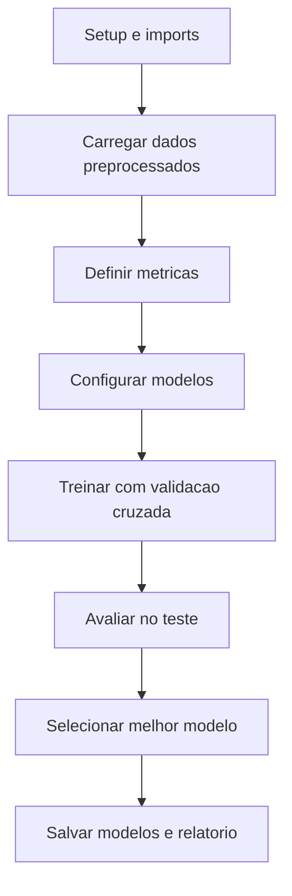

# Treinamento de modelos do notebook 03_model_training_imrpoved.ipynb

Este documento descreve, de forma didatica e objetiva, cada subsecao do notebook `03_model_training_imrpoved.ipynb`. O foco e explicar o processo de treinamento, validacao e salvamento dos resultados.

## Diagrama de Blocos

## 1. Setup e Importacoes

- Define caminhos do projeto e constantes para dados e resultados.
- Importa bibliotecas de ciencia de dados e ML (sklearn, imblearn).
- Importa algoritmos base (RandomForest, GradientBoosting, LogisticRegression, DecisionTree etc.).
- Importa metricas e funcoes de validacao (cross_validate, StratifiedKFold).
- Tenta carregar XGBoost; se nao estiver disponivel, segue com os modelos scikit-learn.
- Define `print_section()` para organizar o output.

## 2. Carregamento dos Dados Preprocessados

- Garante uso dos dados do Notebook 02 (corrigindo problema do notebook original).
- Verifica existencia de `X_train.npy`, `X_test.npy`, `y_train.npy`, `y_test.npy` e `metadata.json`.
- Se algum arquivo faltar, interrompe com erro e instrui executar o Notebook 02.
- Carrega arrays numpy e metadados, imprimindo shapes para confirmacao.

## 3. Definicao de Metricas

- Implementa `calcular_metricas_completas()` com protecoes:
  - Trata divisao por zero em precision/recall/F1/F2.
  - Trata casos em que AUC-ROC nao pode ser calculada.
  - Retorna confusion matrix, taxas de erro, e metricas principais.
- Implementa `exibir_metricas()` para apresentar as metricas com foco em saude:
  - Prioriza recall, F2 e falsos negativos.
  - Exibe accuracy, precision, F1, specificity e AUC quando disponivel.

## 4. Definicao dos Modelos (configuracao robusta)

- Configura modelos com parametros mais conservadores e controles de overfitting.
- Ajusta `n_estimators`, `max_depth`, `min_samples_split` e `min_samples_leaf` nos ensembles.
- Usa `class_weight='balanced'` quando suportado.
- Se XGBoost estiver disponivel, adiciona modelo com regularizacao e subsampling.
- Lista todos os modelos que serao treinados.

## 5. Treinamento dos Modelos (metodologia corrigida)

- Define `StratifiedKFold` com 5 folds.
- Define conjunto de metricas para `cross_validate` incluindo F2 customizado.
- Para cada modelo:
  - Cria pipeline com SMOTE dentro da validacao cruzada (evita leakage).
  - Executa validacao cruzada e registra medias e desvios.
  - Treina pipeline final e avalia no conjunto de teste.
  - Calcula metricas completas e compara consistencia CV vs teste.
- O processo evita SMOTE duplicado e garante avaliacao consistente.

## 6. Comparacao e analise de resultados

- Consolida resultados de teste em `df_resultados` ordenado por F2.
- Identifica o melhor modelo e imprime suas metricas principais.
- Avalia criterios de sucesso:
  - Recall >= 0.70
  - F2 >= 0.65
  - Falsos negativos <= 50
- Compara F2 e recall com os valores esperados do Notebook 02.
- Verifica consistencia entre validacao cruzada e teste final.

## 7. Salvamento dos resultados

- Salva o melhor modelo em `03_models/trained/best_model.pkl`.
- Salva todos os modelos em `03_models/trained/all_trained_models.pkl`.
- Gera CSVs com resultados finais e validacao cruzada em `02_notebooks/06_model_metrics/6_analysis_metrics/`.
- Cria metadados completos (JSON) com detalhes de execucao, criterios e consistencia.
- Gera um relatorio final em Markdown com resumo do processo e arquivos gerados.

## 8. Consolidacao final de metricas

- Gera um CSV consolidado com resultados de validacao cruzada + teste final.
- Salva em `04_reports/executive/consolidated_metrics.csv`.
- Serve como base para relatorios do TCC.
