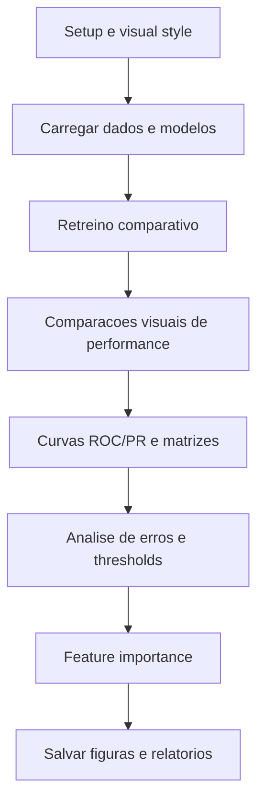

# Analise e otimizacao do notebook 04_analysis_optimization_improved.ipynb

Este documento descreve, de forma didatica e objetiva, cada subsecao do notebook `04_analysis_optimization_improved.ipynb`. O foco e explicar as analises, comparacoes e etapas de otimizacao de modelos.

## Diagrama de Blocos

## 1. Setup e importacoes

- Importa bibliotecas de ML, metricas, validacao cruzada e busca de hiperparametros.
- Importa SMOTE e `ImbPipeline` para evitar data leakage.
- Carrega bibliotecas opcionais (XGBoost e LightGBM) quando disponiveis.
- Define configuracoes profissionais de visualizacao (fontes, DPI alto, paleta colorblind-friendly).
- Cria funcoes auxiliares para salvar figuras em alta qualidade e padronizar estilos de graficos.
- Define `feature_names` para interpretar importancias de variaveis.

## 2. Carregamento dos dados e modelos

- Verifica a existencia dos arquivos processados do notebook 02 (balanceados e originais).
- Carrega:
  - `X_train_balanced`, `y_train_balanced` para comparacoes.
  - `X_train`, `y_train` originais para pipelines com SMOTE dentro da validacao.
  - `X_test`, `y_test` para avaliacao final.
- Carrega o melhor modelo do notebook 03 se existir; caso contrario, treina um modelo de fallback.
- Tenta carregar resultados anteriores de comparacao de modelos (CSV).

## 3. Retreinamento de modelos para analise

- Recria um conjunto de modelos base para analise comparativa.
- Treina modelos para gerar predicoes e metricas consistentes.
- Usa metricas focadas em saude (recall, F2 e falsos negativos).

## 4. Comparacoes visuais de modelos

### 4.1 Comparacao visual profissional

- Plota comparativos de metricas (recall, F2, precision, accuracy) com estilo academico.
- Usa cores e anotacoes para destacar o melhor desempenho.

### 4.2 Matrizes de confusao profissionais

- Gera matrizes de confusao com valores absolutos e percentuais.
- Destaca falsos negativos e falsos positivos.
- Salva figuras em alta resolucao para uso em relatorios.

### 4.3 Curvas ROC

- Plota curvas ROC para cada modelo e calcula AUC.
- Identifica modelos com melhor separacao entre classes.

### 4.4 Curvas Precision-Recall

- Gera curvas PR para comparar desempenho em classes desbalanceadas.
- Ajuda a entender trade-offs entre precision e recall.

### 4.5 Importancia de features

- Para modelos com `feature_importances_`, plota ranking das variaveis.
- Cria um consenso de importancia combinando modelos para identificar features robustas.

## 5. Analise detalhada de erros

- Analisa distribuicoes de erros (FN e FP) por modelo.
- Identifica casos problematicos e tendencias de erro.
- Fornece insights sobre ajustes possiveis.

## 6. Otimizacao de threshold

- Avalia diferentes limiares de classificacao.
- Busca threshold que maximize recall e F2, mantendo FN baixo.
- Apresenta recomendacao de threshold clinicamente adequado.

## 7. Otimizacao de hiperparametros

### 7.1 Grid Search - Gradient Boosting

- Implementa grid search com SMOTE dentro do pipeline.
- Usa validacao cruzada estratificada para evitar leakage.
- Avalia combinacoes de `n_estimators`, `learning_rate` e `max_depth`.

### 7.2 Random Search - Random Forest

- Usa `RandomizedSearchCV` com distribuicoes de hiperparametros.
- Busca combinacoes com melhor F2/recall.

### 7.3 Otimizacao com XGBoost (se disponivel)

- Executa busca em XGBoost quando a biblioteca existe.
- Ajusta parametros de complexidade e regularizacao.

### 7.4 Comparacao base vs otimizado

- Compara modelos base e otimizados com foco em F2, recall e FN.
- Destaca ganhos ou perdas apos tuning.

### 7.5 Selecao do melhor modelo final

- Consolida candidatos (base + otimizados).
- Ranqueia por F2-score e valida criterios de sucesso.
- Define o modelo vencedor para uso final.

## 8. Relatorio executivo

- Gera um resumo estruturado com:
  - Objetivo, metodologia e metricas priorizadas.
  - Resultado final do melhor modelo.
  - Analise de erros e criterios clinicos.
  - Recomendacoes de uso clinico.
  - Importancia de features.
  - Ranking completo de modelos.

## 9. Salvamento final

- Salva o modelo final otimizado em `03_models/final/best_model_optimized.pkl`.
- Salva modelos otimizados individuais (GB, RF, XGB) se existirem.
- Gera relatorio JSON e CSV com comparacoes finais.

## 10. Comparacao final (base vs otimizado)

- Explica problemas anteriores (pipeline inconsistentes e leakage).
- Documenta correcoes aplicadas:
  - Pipeline com SMOTE dentro de cada fold.
  - Uso de dados originais para validacao.
  - Parametros coerentes entre base e otimizado.
- Compara desempenho esperado entre base e modelo otimizado corrigido.

## 11. Encerramento

- Imprime resumo final com modelo vencedor, metricas e arquivos gerados.
- Sugere proximos passos: validacao externa, interface clinica e monitoramento.
