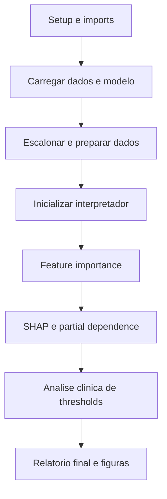

# Interpretabilidade do notebook 05_interpretability_reports_improved.ipynb

Este documento descreve, de forma didatica e objetiva, cada subsecao do notebook `05_interpretability_reports_improved.ipynb`. O foco e explicar as tecnicas de interpretabilidade e a geracao de relatorios finais.

## Diagrama de Blocos

## 1. Setup e importacoes

- Define caminhos do projeto e constantes globais.
- Importa bibliotecas de interpretabilidade e visualizacao (SHAP, sklearn, matplotlib, seaborn).
- Tenta carregar modulos customizados (`config`, `helpers`, `ModelInterpreter`, `MedicalAnalyzer`).
- Em caso de falha, cria fallbacks para garantir a execucao do notebook.
- Configura parametros visuais padrao para graficos.

## 2. Carregamento do melhor modelo e dados

- Carrega configuracao e caminhos de resultados.
- Le o resumo do melhor modelo em `model_training_summary.json`.
- Carrega dados originais processados (sem feature engineering) para interpretabilidade.
- Se nao encontrar, faz fallback para os dados originais do Kaggle e aplica traducao/imputacao.
- Define features e target de forma robusta e imprime distribuicoes basicas.

## 3. Carregamento do split de treinamento

- Carrega `X_train`, `X_test`, `y_train`, `y_test` do Notebook 02.
- Reconstroi `feature_names` quando necessario.
- Aplica escalonamento (carrega scaler salvo ou cria novo).
- Converte arrays para DataFrames com colunas para interpretabilidade.

## 4. Inicializacao do ModelInterpreter

- Cria instancia do interpretador e injeta modelo, dados e nomes de features.
- Verifica disponibilidade de SHAP e tipo de importancia (intrinseca ou coeficientes).
- Exibe resumo do setup para confirmacao.

## 5. Feature Importance Analysis

- Implementa analise robusta por multiplos metodos:
  - Importancia intrinseca (se o modelo suporta `feature_importances_`).
  - Permutation importance.
  - Coeficientes (para modelos lineares).
- Produz ranking das variaveis e salva resultados para uso posterior.

## 6. SHAP Analysis

- Executa SHAP (se disponivel) para explicacoes globais e locais.
- Caso SHAP nao esteja instalado, mantem fluxo com metodos alternativos.

## 7. Partial Dependence Analysis

- Calcula dependencia parcial para features principais.
- Permite interpretar efeitos marginais das variaveis na predicao.

## 8. Visualizacoes de interpretabilidade

- Cria graficos de importancia, SHAP e dependencia parcial.
- Gera figuras com estilo padrao e salva em diretorios de resultados.

## 9. Analise medica detalhada

- Usa `MedicalAnalyzer` para gerar relatorio clinico.
- Relaciona features importantes com fatores de risco conhecidos.
- Identifica categorias clinicas mais relevantes.

## 10. Suporte a decisao clinica

- Prop?e thresholds para diferentes usos:
  - Triagem (alta sensibilidade).
  - Confirmacao diagnostica (alta especificidade).
  - Uso balanceado.
- Associa thresholds a casos de uso clinico.

## 11. Visualizacao da performance clinica

- Resume metricas do modelo em contexto clinico.
- Relaciona F1, AUC e prevalencia da doenca.

## 12. Geracao do relatorio final de interpretabilidade

- Combina resultados de interpretabilidade com analise clinica.
- Monta um objeto consolidado (`final_interpretation_report`).

## 13. Salvamento dos resultados finais

- Salva resultados completos em `04_reports/interpretability`:
  - `interpretability_report.json`
  - `clinical_thresholds_analysis.csv`
  - `clinical_category_importance.csv`
  - `feature_importance_*.csv`
  - `final_predictions_with_explanations.csv`
- Gera dois relatorios em Markdown:
  - `executive_summary.md`
  - `technical_report.md`

## 14. Resumo final do projeto

- Imprime um resumo geral do projeto, metricas e entregaveis.
- Indica os caminhos para os relatorios finais gerados.
