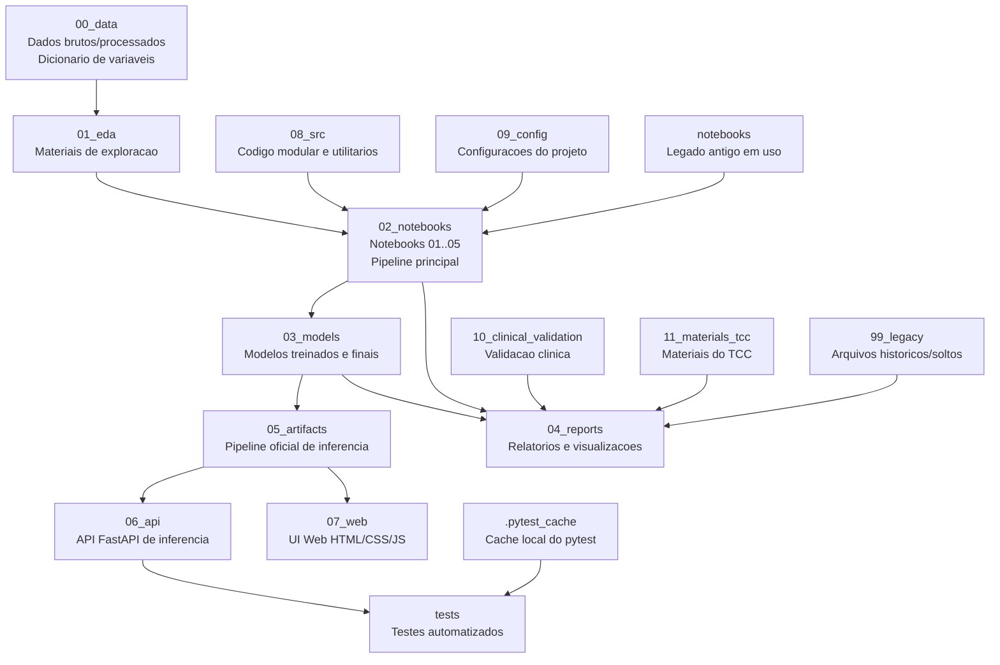

# Diretórios do projeto (diagrama de responsabilidades)

Este diagrama mostra todos os diretorios do repositorio e a responsabilidade de cada um.

## Diagrama de blocos

```mermaid
flowchart TB
  A[00_data<br/>Dados brutos/processados<br/>Dicionario de variaveis] --> B[01_eda<br/>Materiais de exploracao]
  B --> C[02_notebooks<br/>Notebooks 01..05<br/>Pipeline principal]
  C --> D[03_models<br/>Modelos treinados e finais]
  D --> E[05_artifacts<br/>Pipeline oficial de inferencia]
  E --> F[06_api<br/>API FastAPI de inferencia]
  E --> G[07_web<br/>UI Web HTML/CSS/JS]
  F --> H[tests<br/>Testes automatizados]
  D --> I[04_reports<br/>Relatorios e visualizacoes]
  C --> I
  J[08_src<br/>Codigo modular e utilitarios] --> C
  K[09_config<br/>Configuracoes do projeto] --> C
  L[10_clinical_validation<br/>Validacao clinica] --> I
  M[11_materials_tcc<br/>Materiais do TCC] --> I
  N[99_legacy<br/>Arquivos historicos/soltos] --> I
  O[notebooks<br/>Legado antigo em uso] --> C
  P[.pytest_cache<br/>Cache local do pytest] --> H
```
