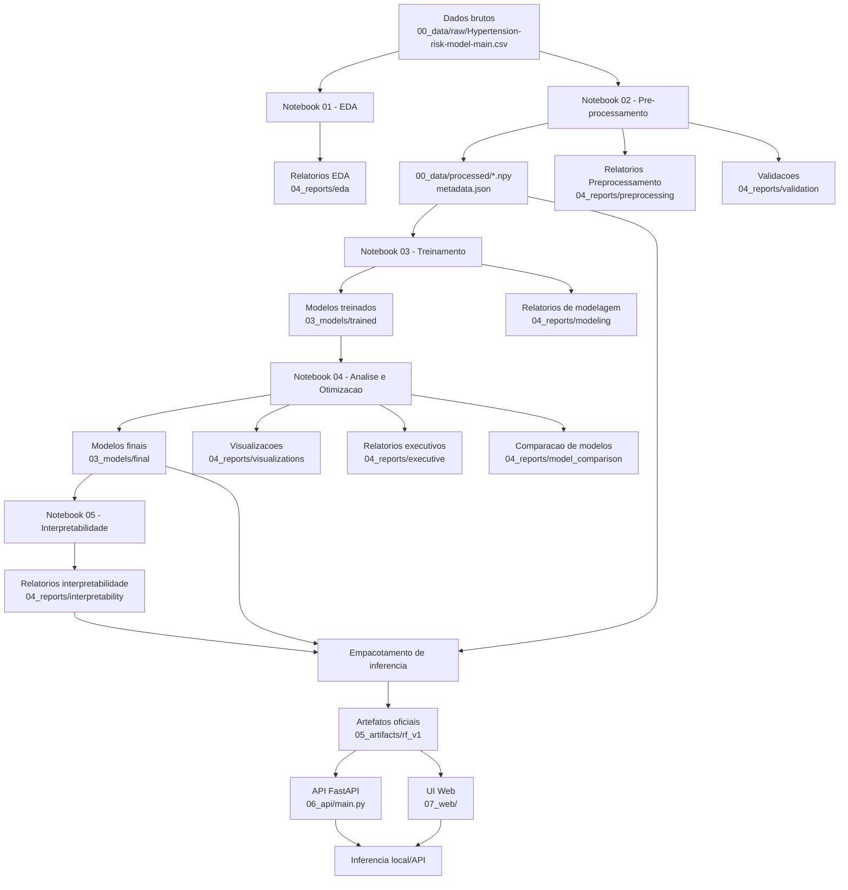

# Diagrama do Pipeline (Mermaid)

```mermaid
flowchart TB
  A[Dados brutos<br/>00_data/raw/Hypertension-risk-model-main.csv] --> B[Notebook 01 - EDA]
  B --> R1[Relatorios EDA<br/>04_reports/eda]
  A --> C[Notebook 02 - Pre-processamento]
  C --> D[00_data/processed/*.npy<br/>metadata.json]
  C --> R2[Relatorios Preprocessamento<br/>04_reports/preprocessing]
  C --> R3[Validacoes<br/>04_reports/validation]

  D --> E[Notebook 03 - Treinamento]
  E --> M1[Modelos treinados<br/>03_models/trained]
  E --> R4[Relatorios de modelagem<br/>04_reports/modeling]

  M1 --> F[Notebook 04 - Analise e Otimizacao]
  F --> M2[Modelos finais<br/>03_models/final]
  F --> R5[Visualizacoes<br/>04_reports/visualizations]
  F --> R6[Relatorios executivos<br/>04_reports/executive]
  F --> R7[Comparacao de modelos<br/>04_reports/model_comparison]

  M2 --> G[Notebook 05 - Interpretabilidade]
  G --> R8[Relatorios interpretabilidade<br/>04_reports/interpretability]

  M2 --> H[Empacotamento de inferencia]
  D --> H
  R8 --> H
  H --> I[Artefatos oficiais<br/>05_artifacts/rf_v1]

  I --> J[API FastAPI<br/>06_api/main.py]
  I --> K[UI Web<br/>07_web/]
  J --> L[Inferencia local/API]
  K --> L
```

Observacao: a inferencia usa o pipeline oficial em `05_artifacts/rf_v1` (imputer + scaler + modelo) e thresholds clinicos consolidados.
