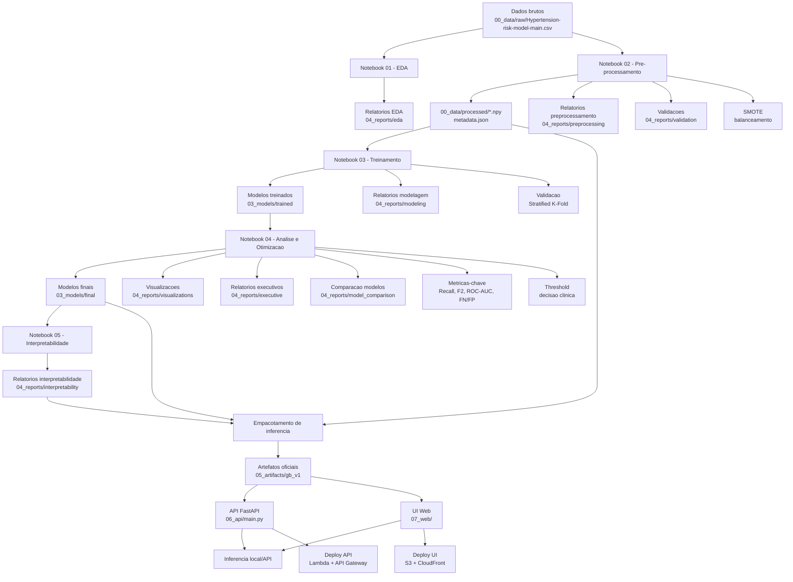

# TCC - Predição de Hipertensão com Machine Learning

## Autores

**Orientador e Desenvolvedor:**
- Prof. Dr. Anderson Henrique Rodrigues Ferreira
- CEUNSP - Centro Universitário Nossa Senhora do Patrocínio
- anderson.ferreira@ceunsp.edu.br

**Alunos Desenvolvedores:**
- Marcelo V Duarte Colpani
- Nicolas Souza
- Rubens Jose Collin
- Tiago Dias Borges

## Visão Geral do Projeto

Este projeto implementa um **sistema completo de aprendizado de máquina para predição de risco de hipertensão**, desenvolvido como Trabalho de Conclusão de Curso (TCC). O trabalho aborda um problema crítico de saúde pública utilizando técnicas avançadas de ciência de dados, com foco em **interpretabilidade clínica**, **validações metodológicas robustas** e **pipeline de inferência pronto para produção**.

### O Problema

A hipertensão arterial é uma das principais causas de morbimortalidade cardiovascular no mundo, afetando aproximadamente 1,28 bilhão de adultos globalmente. A detecção precoce de indivíduos em risco é fundamental para intervenções preventivas eficazes. No entanto, o rastreamento populacional enfrenta desafios:

- **Custo elevado** de avaliações médicas em larga escala
- **Recursos limitados** no sistema de saúde para acompanhamento universal
- **Necessidade de priorização** de pacientes com maior risco
- **Assimetria no custo dos erros**: não detectar um caso de risco (falso negativo) tem consequências mais graves que gerar um alarme falso (falso positivo)

### A Solução

Este trabalho desenvolve um **modelo preditivo baseado em dados clínicos e demográficos** que auxilia na identificação precoce de indivíduos em risco de hipertensão. O diferencial está em:

1. **Metodologia Rigorosa**: Pipeline completo seguindo melhores práticas de ML em saúde, com validação cruzada estratificada e tratamento correto de desbalanceamento de classes (SMOTE aplicado apenas no treino, dentro do pipeline de CV para evitar data leakage)

2. **Foco Clínico**: Priorização de métricas clinicamente relevantes (Recall e F2-Score) que minimizam falsos negativos, refletindo o custo real dos erros em aplicações médicas

3. **Interpretabilidade**: Análises de feature importance, SHAP values e Partial Dependence Plots que permitem compreender quais fatores influenciam as predições, essencial para confiança clínica

4. **Reprodutibilidade**: Documentação completa, artefatos versionados e pipeline padronizado que permite replicação e auditoria dos resultados

### Dataset

- **Fonte**: [Kaggle - Hypertension Risk Model](https://www.kaggle.com/datasets/khan1803115/hypertension-risk-model-main/data)
- **Tamanho**: 4.240 pacientes
- **Features**: 12 variáveis (demográficas, clínicas e biomarcadores)
- **Target**: Risco de hipertensão (classificação binária: 0 = baixo risco, 1 = alto risco)
- **Desbalanceamento**: Dataset desbalanceado, com menor proporção de casos de alto risco (característica típica de dados médicos)

**Variáveis incluídas**: sexo, idade, status de fumante, cigarros/dia, uso de medicamentos para pressão, diabetes, colesterol total, pressão sistólica, pressão diastólica, IMC, frequência cardíaca e glicose.

### Principais Resultados

O modelo final (Random Forest otimizado) alcançou:

| Métrica | Valor | Interpretação Clínica |
|---------|-------|----------------------|
| **Recall (Sensibilidade)** | **92.0%** | Detecta 92% dos casos de risco real |
| **F2-Score** | **0.89** | Excelente balanço priorizando detecção de casos |
| **AUC-ROC** | **0.95** | Excelente capacidade discriminativa |
| **Especificidade** | **89.8%** | Minimiza falsos alarmes (89.8% das pessoas sem risco são corretamente identificadas) |
| **Falsos Negativos** | **37 casos** | Apenas 8% dos casos de risco não foram detectados |
| **Falsos Positivos** | **104 casos** | Taxa controlada de alarmes falsos |

**Significado Clínico**: De cada 100 pacientes com risco real de hipertensão, o modelo identifica corretamente 92, permitindo intervenção preventiva precoce. A taxa de falsos negativos (8%) é considerada aceitável para um sistema de triagem, enquanto a especificidade de 89.8% evita sobrecarga excessiva do sistema de saúde com falsos alarmes.

### Variabilidade e Estabilidade dos Resultados

Resultados de validação cruzada são apresentados como média +/- dp (robustez e estabilidade). Fonte: `04_reports/executive_report/consolidated_metrics.csv`.  
Estabilidade por proporções treino/teste: `04_reports/preprocessing/teste_proporcoes.csv` e `04_reports/analises/teste_proporcoes_granular.csv`.

| Modelo | F2 (media +/- dp) | Recall (media +/- dp) | Precisao media | Acuracia media | AUC media |
|---|---|---|---|---|---|
| Random Forest | 0.870 +/- 0.031 | 0.893 +/- 0.028 | 0.790 | 0.893 | 0.948 |
| Logistic Regression | 0.855 +/- 0.030 | 0.876 +/- 0.027 | 0.779 | 0.884 | 0.946 |
| Gradient Boosting | 0.851 +/- 0.027 | 0.867 +/- 0.026 | 0.795 | 0.889 | 0.947 |
| XGBoost | 0.843 +/- 0.029 | 0.855 +/- 0.027 | 0.797 | 0.887 | 0.948 |
| Decision Tree | 0.766 +/- 0.009 | 0.772 +/- 0.009 | 0.744 | 0.847 | 0.863 |

### Diferenciais Metodológicos

1. **Validação Anti-Leakage**: SMOTE aplicado exclusivamente no conjunto de treino e, durante validação cruzada, dentro do pipeline de cada fold, evitando superestimação de desempenho

2. **Teste de Proporções**: Avaliação sistemática de diferentes proporções treino/teste (60/40, 70/30, 75/25, 80/20) com múltiplas repetições para identificar o split mais estável

3. **Métricas Orientadas ao Contexto**: Uso de F2-Score como métrica principal (dá 2× mais peso ao Recall em relação à Precision), refletindo a prioridade clínica de minimizar falsos negativos

4. **Otimização de Threshold**: Análise de diferentes limiares de decisão para contextos clínicos específicos (triagem de alta sensibilidade vs. confirmação de alta especificidade)

5. **Feature Engineering Médico**: Criação de features derivadas baseadas em conhecimento médico especializado (MAP, pressão de pulso, categorização AHA/ACC 2017, índices de risco cardiovascular)

6. **Interpretabilidade Completa**: SHAP values, feature importance intrínseca e por permutação, análise de limiares clínicos e categorias de importância médica

### Fundamentação Teórica

Os guias metodológicos em `11_materials_tcc/` fundamentam as escolhas técnicas:

- **`guia_metricas_hipertensao.html`**: Justificativa clínica da priorização de Recall e F2-Score, explicação detalhada da matriz de confusão no contexto médico, e análise do custo assimétrico dos erros (FN vs FP)

- **`tutorial_tecnicas_avancadas_orientador_bw.html`**: Sequência metodológica rigorosa (SMOTE → testes de proporção → K-Fold → Stratified K-Fold → pipeline final), comparação SMOTE vs RandomOverSampler, e protocolos de validação robusta

Esses materiais garantem que cada decisão metodológica está alinhada com o estado da arte em ML aplicado à saúde.

---

## Estrutura do Projeto

Este repositório implementa um pipeline completo de ML para predição de risco de hipertensão, com foco em interpretabilidade clínica, validações robustas e inferência pronta para API.

## Estrutura (nova organizacao)

- `00_data/` dados brutos e processados
- `01_eda/` materiais de EDA
- `02_notebooks/` notebooks (01..05)
- `03_models/` modelos treinados e finais
- `04_reports/` relatorios, validacoes e visualizacoes
- `05_artifacts/` pipeline oficial de inferencia
- `06_api/` API FastAPI
- `07_web/` interface web (HTML/CSS/JS)
- `08_src/` codigo fonte modular
- `09_config/` configuracoes
- `10_clinical_validation/` scripts de validacao clinica
- `11_materials_tcc/` materiais do TCC
- `12_deploy_aws/` scripts e documentacao para deploy na AWS
- `99_legacy/` arquivos historicos/soltos

## Pipeline completo (do notebook a inferencia)

1) Dados brutos  
- Fonte: `00_data/raw/Hypertension-risk-model-main.csv`

2) EDA (Notebook 01)  
- Analises: estatisticas descritivas, missing values, distribuicoes, correlacoes, VIF.  
- Saidas: `04_reports/eda/*`

3) Pre-processamento (Notebook 02)  
- Tradução de colunas, imputacao por mediana, escalonamento.  
- Split 65/35, SMOTE apenas no treino.  
- Saidas:  
  - `00_data/processed/*.npy`  
  - `00_data/processed/metadata.json`  
  - `04_reports/preprocessing/*`  
  - `04_reports/validation/*`

4) Treinamento (Notebook 03)  
- Treino com CV, metricas F2/recall/FN.  
- Saidas:  
  - `03_models/trained/*`  
  - `04_reports/modeling/*`

5) Analise e otimizacao (Notebook 04)  
- Comparacoes, grid/random search e threshold.  
- Saidas:  
  - `03_models/final/*`  
  - `04_reports/visualizations/*`  
  - `04_reports/executive/*`  
  - `04_reports/model_comparison/*`

6) Interpretabilidade (Notebook 05)  
- Feature importance, SHAP, partial dependence.  
- Saidas: `04_reports/interpretability/*`

7) Empacotamento para inferencia  
- Pipeline oficial (imputer + scaler + modelo)  
- Artefatos: `05_artifacts/gb_v1/*`

8) API + UI  
- API: `06_api/main.py`  
- UI: `07_web/index.html`  
- Endpoint: `POST /predict`

## Modelo oficial de inferencia

- Algoritmo: Random Forest (otimizado)
- Parametros principais: `n_estimators=210`, `max_depth=24`, `min_samples_leaf=3`, `max_features='log2'`, `class_weight='balanced_subsample'`
- Performance: Recall=92.0%, F2-Score=0.89, AUC-ROC=0.95
- Artefatos: `05_artifacts/rf_v1/`

## Bases metodologicas (SMOTE, validacao e metricas)

Os guias em `11_materials_tcc/guia_metricas_hipertensao.html` e `11_materials_tcc/tutorial_tecnicas_avancadas_orientador_bw.html` fundamentam as escolhas metodologicas:

- **Balanceamento (SMOTE)**: necessario devido ao desbalanceamento de classes. O SMOTE gera amostras sinteticas apenas no treino (incluindo em cada fold), reduz vies e melhora a capacidade do modelo de detectar casos positivos sem inflar o teste.  
- **Validacao robusta**: uso de Stratified K-Fold e teste de multiplas proporcoes treino/teste para estabilidade estatistica e representatividade das classes.  
- **Metricas prioritarias**: Sensibilidade/Recall (minimizar falsos negativos), F2-Score (prioriza Recall), ROC-AUC, especificidade, precision, e monitoramento explicito de FN e FP na matriz de confusao.  
- **Ajuste de threshold**: analise de limiar de decisao para equilibrar sensibilidade e especificidade, privilegiando triagem clinica (reduzir FN).  

Links diretos:
- `11_materials_tcc/guia_metricas_hipertensao.html`
- `11_materials_tcc/tutorial_tecnicas_avancadas_orientador_bw.html`
- `04_reports/docs/LOG_ARTEFATOS_NOTEBOOKS.md` (log de saidas dos notebooks)

Ordem oficial das features (12):
1. sexo  
2. idade  
3. fumante_atualmente  
4. cigarros_por_dia  
5. medicamento_pressao  
6. diabetes  
7. colesterol_total  
8. pressao_sistolica  
9. pressao_diastolica  
10. imc  
11. frequencia_cardiaca  
12. glicose

## Como rodar localmente

Instalar dependencias:
```bash
pip install -r requirements.txt
```

Inferencia via script:
```bash
python 08_src/inference/inference.py
```

Subir API:
```bash
python -m uvicorn main:app --app-dir 06_api --reload
```

Scripts padronizados:
```bash
./run_api.sh
```

```powershell
./run_api.ps1
```

Testes basicos:
```bash
pytest -q
```

Abrir UI:
- http://127.0.0.1:8000/app

## Deploy na AWS (Producao)

Para fazer o deploy da aplicacao na AWS (Lambda + API Gateway + S3 + CloudFront):

📁 **Todos os arquivos de deploy estao em**: [12_deploy_aws/](12_deploy_aws/)

### Guias Disponiveis

- 🚀 **Inicio Rapido**: [12_deploy_aws/DEPLOY_RESUMO.md](12_deploy_aws/DEPLOY_RESUMO.md) - 5 passos (~30 min)
- 📖 **Guia Completo**: [12_deploy_aws/GUIA_DEPLOY_RAPIDO.md](12_deploy_aws/GUIA_DEPLOY_RAPIDO.md) - Passo a passo detalhado (~90 min)
- ✅ **Checklist**: [12_deploy_aws/CHECKLIST_DEPLOY.md](12_deploy_aws/CHECKLIST_DEPLOY.md) - Validacao durante deploy
- 📑 **Indice**: [12_deploy_aws/DEPLOY_INDICE.md](12_deploy_aws/DEPLOY_INDICE.md) - Navegacao entre arquivos

### Deploy em 3 Comandos

```bash
# 1. Entre no diretorio de deploy
cd 12_deploy_aws

# 2. Configure suas credenciais AWS
cp deploy_config.example.sh deploy_config.sh
nano deploy_config.sh  # Edite: AWS_REGION, AWS_ACCOUNT_ID, S3_BUCKET_NAME

# 3. Execute o script de deploy
./deploy_aws.sh
```

### Conteudo do Diretorio 12_deploy_aws/

- `Dockerfile` - Imagem Docker otimizada para Lambda
- `.dockerignore` - Otimizacao do build
- `deploy_config.example.sh` - Template de configuracao
- `deploy_aws.sh` - Script automatizado (menu interativo)
- `test_local.sh` - Validacao antes do deploy
- `DEPLOY_RESUMO.md` - Guia rapido
- `GUIA_DEPLOY_RAPIDO.md` - Tutorial completo
- `CHECKLIST_DEPLOY.md` - Lista de validacao
- `DEPLOY_INDICE.md` - Indice de navegacao
- `ARQUIVOS_CRIADOS.md` - Inventario completo

### Documentacao Tecnica Adicional

- [04_reports/docs/DEPLOY_AWS.md](04_reports/docs/DEPLOY_AWS.md) - Documentacao tecnica detalhada
- [04_reports/docs/PASSO_API_GATEWAY.md](04_reports/docs/PASSO_API_GATEWAY.md) - Configuracao do API Gateway

## Documentacao do pipeline

Veja tambem o diagrama de diretorios (responsabilidades por pasta) em [04_reports/docs/DIRETORIOS_DIAGRAMA.md](04_reports/docs/DIRETORIOS_DIAGRAMA.md).

- [04_reports/docs/PIPELINE_DESCRICAO.md](04_reports/docs/PIPELINE_DESCRICAO.md)  
- `04_reports/docs/PIPELINE_DIAGRAMA.md`  
- `04_reports/docs/PIPELINE_INTERATIVO.html` (diagrama interativo)
- `04_reports/docs/TUTORIAL_INFERENCIA_LOCAL.md`
- `00_data/README.md` (dados e dicionario de variaveis)
- `04_reports/docs/DEPLOY_AWS.md` (deploy)
- `04_reports/docs/PASSO_API_GATEWAY.md` (API Gateway)
- `04_reports/docs/DIRETORIOS_DIAGRAMA.md` (diagrama de diretorios)
- `04_reports/docs/LOG_ARTEFATOS_NOTEBOOKS.md` (log de artefatos)

## Pipeline em diagrama de blocos



Obs: o Mermaid no README nao oferece zoom/arraste. Para interatividade local e no GitHub, use `04_reports/docs/PIPELINE_INTERATIVO.html`.

## Disclaimer medico

Este projeto e educacional. As predicoes nao substituem avaliacao clinica profissional.
