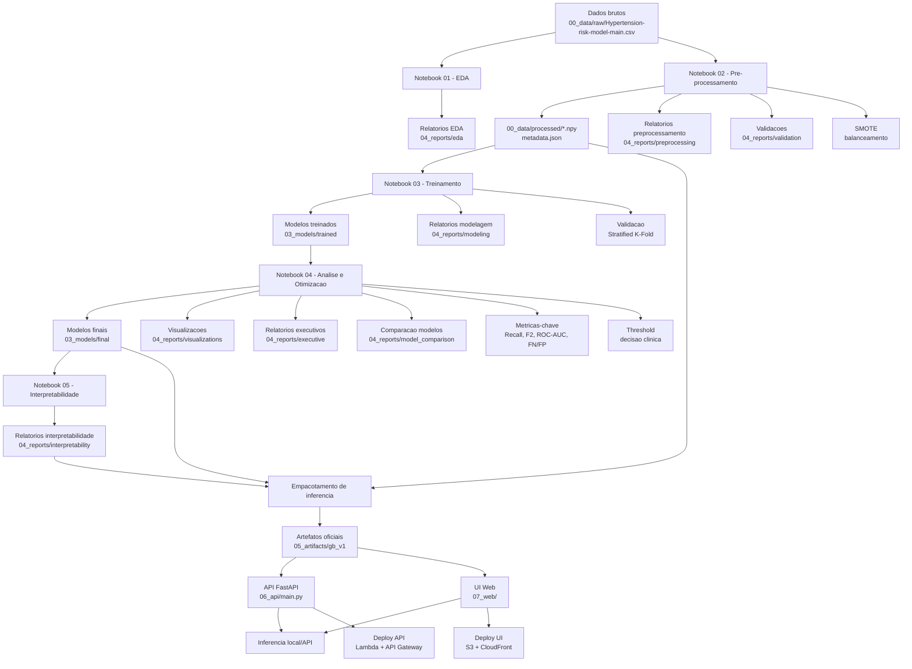

# TCC - Predicao de Hipertensao com Machine Learning

Este repositorio implementa um pipeline completo de ML para predicao de risco de hipertensao, com foco em interpretabilidade clinica, validacoes robustas e inferencia pronta para API.

## Estrutura (nova organizacao)

- `00_data/` dados brutos e processados  
- `01_eda/` materiais de EDA  
- `02_notebooks/` notebooks (01..05)  
- `03_models/` modelos treinados e finais  
- `04_reports/` relatorios, validacoes e visualizacoes  
- `05_artifacts/` pipeline oficial de inferencia  
- `06_api/` API FastAPI  
- `07_web/` interface web (HTML/CSS/JS)  
- `08_src/` codigo fonte modular  
- `09_config/` configuracoes  
- `10_clinical_validation/` scripts de validacao clinica  
- `11_materials_tcc/` materiais do TCC  
- `99_legacy/` arquivos historicos/soltos

## Pipeline completo (do notebook a inferencia)

1) Dados brutos  
- Fonte: `00_data/raw/Hypertension-risk-model-main.csv`

2) EDA (Notebook 01)  
- Analises: estatisticas descritivas, missing values, distribuicoes, correlacoes, VIF.  
- Saidas: `04_reports/eda/*`

3) Pre-processamento (Notebook 02)  
- Tradução de colunas, imputacao por mediana, escalonamento.  
- Split 65/35, SMOTE apenas no treino.  
- Saidas:  
  - `00_data/processed/*.npy`  
  - `00_data/processed/metadata.json`  
  - `04_reports/preprocessing/*`  
  - `04_reports/validation/*`

4) Treinamento (Notebook 03)  
- Treino com CV, metricas F2/recall/FN.  
- Saidas:  
  - `03_models/trained/*`  
  - `04_reports/modeling/*`

5) Analise e otimizacao (Notebook 04)  
- Comparacoes, grid/random search e threshold.  
- Saidas:  
  - `03_models/final/*`  
  - `04_reports/visualizations/*`  
  - `04_reports/executive/*`  
  - `04_reports/model_comparison/*`

6) Interpretabilidade (Notebook 05)  
- Feature importance, SHAP, partial dependence.  
- Saidas: `04_reports/interpretability/*`

7) Empacotamento para inferencia  
- Pipeline oficial (imputer + scaler + modelo)  
- Artefatos: `05_artifacts/gb_v1/*`

8) API + UI  
- API: `06_api/main.py`  
- UI: `07_web/index.html`  
- Endpoint: `POST /predict`

## Modelo oficial de inferencia

- Algoritmo: Gradient Boosting  
- Parametros: `n_estimators=100`, `learning_rate=0.05`, `max_depth=3`  
- Artefatos: `05_artifacts/gb_v1/`

## Bases metodologicas (SMOTE, validacao e metricas)

Os guias em `11_materials_tcc/guia_metricas_hipertensao.html` e `11_materials_tcc/tutorial_tecnicas_avancadas_orientador_bw.html` fundamentam as escolhas metodologicas:

- **Balanceamento (SMOTE)**: necessario devido ao desbalanceamento de classes. O SMOTE gera amostras sinteticas apenas no treino (incluindo em cada fold), reduz vies e melhora a capacidade do modelo de detectar casos positivos sem inflar o teste.  
- **Validacao robusta**: uso de Stratified K-Fold e teste de multiplas proporcoes treino/teste para estabilidade estatistica e representatividade das classes.  
- **Metricas prioritarias**: Sensibilidade/Recall (minimizar falsos negativos), F2-Score (prioriza Recall), ROC-AUC, especificidade, precision, e monitoramento explicito de FN e FP na matriz de confusao.  
- **Ajuste de threshold**: analise de limiar de decisao para equilibrar sensibilidade e especificidade, privilegiando triagem clinica (reduzir FN).  

Links diretos:
- `11_materials_tcc/guia_metricas_hipertensao.html`
- `11_materials_tcc/tutorial_tecnicas_avancadas_orientador_bw.html`
- `04_reports/docs/LOG_ARTEFATOS_NOTEBOOKS.md` (log de saidas dos notebooks)

Ordem oficial das features (12):
1. sexo  
2. idade  
3. fumante_atualmente  
4. cigarros_por_dia  
5. medicamento_pressao  
6. diabetes  
7. colesterol_total  
8. pressao_sistolica  
9. pressao_diastolica  
10. imc  
11. frequencia_cardiaca  
12. glicose

## Como rodar localmente

Instalar dependencias:
```bash
pip install -r requirements.txt
```

Inferencia via script:
```bash
python 08_src/inference/inference.py
```

Subir API:
```bash
python -m uvicorn main:app --app-dir 06_api --reload
```

Scripts padronizados:
```bash
./run_api.sh
```

```powershell
./run_api.ps1
```

Testes basicos:
```bash
pytest -q
```

Abrir UI:
- http://127.0.0.1:8000/app

## Documentacao do pipeline

Veja tambem o diagrama de diretorios (responsabilidades por pasta) em [04_reports/docs/DIRETORIOS_DIAGRAMA.md](04_reports/docs/DIRETORIOS_DIAGRAMA.md).

- [04_reports/docs/PIPELINE_DESCRICAO.md](04_reports/docs/PIPELINE_DESCRICAO.md)  
- `04_reports/docs/PIPELINE_DIAGRAMA.md`  
- `04_reports/docs/PIPELINE_INTERATIVO.html` (diagrama interativo)
- `04_reports/docs/TUTORIAL_INFERENCIA_LOCAL.md`
- `00_data/README.md` (dados e dicionario de variaveis)
- `04_reports/docs/DEPLOY_AWS.md` (deploy)
- `04_reports/docs/PASSO_API_GATEWAY.md` (API Gateway)
- `04_reports/docs/DIRETORIOS_DIAGRAMA.md` (diagrama de diretorios)
- `04_reports/docs/LOG_ARTEFATOS_NOTEBOOKS.md` (log de artefatos)

## Pipeline em diagrama de blocos



Obs: o Mermaid no README nao oferece zoom/arraste. Para interatividade local e no GitHub, use `04_reports/docs/PIPELINE_INTERATIVO.html`.

## Disclaimer medico

Este projeto e educacional. As predicoes nao substituem avaliacao clinica profissional.
