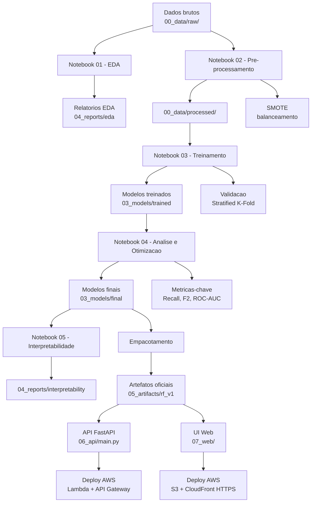

# TCC - Predicao de Hipertensao com Machine Learning

---

## Demo Online

### Pagina de Apresentacao (GitHub Pages)

**Metodologia, resultados e metricas do projeto:**

<a href="https://anderson-ferreira-83.github.io/Hyperten_ML/" target="_blank" rel="noopener noreferrer" title="Abrir apresentacao em nova aba" aria-label="Abrir apresentacao do projeto em nova aba"><strong>Ver Apresentacao do Projeto</strong></a>

### Aplicacao em Producao (AWS)

**Acesse a aplicacao em producao (HTTPS seguro - funciona no celular):**

<a href="https://dl52cpaeesvk0.cloudfront.net/ui/index.html" target="_blank" rel="noopener noreferrer" title="Abrir aplicacao em nova aba" aria-label="Abrir aplicacao de predicao de risco em nova aba"><strong>Testar Predição de Risco</strong></a>

### Teste Rapido da API

**Windows (PowerShell):**
```powershell
# Health Check (GET)
Invoke-RestMethod -Uri "https://yrac79mzj9.execute-api.sa-east-1.amazonaws.com/health" -Method Get

# Predicao (POST) - Paciente baixo risco
$body = @{
    sexo=1; idade=50; fumante_atualmente=0; cigarros_por_dia=0
    medicamento_pressao=0; diabetes=0; colesterol_total=200
    pressao_sistolica=120; pressao_diastolica=80; imc=25
    frequencia_cardiaca=70; glicose=90
} | ConvertTo-Json
Invoke-RestMethod -Uri "https://yrac79mzj9.execute-api.sa-east-1.amazonaws.com/predict" -Method Post -Body $body -ContentType "application/json"

# Predicao (POST) - Paciente alto risco
$body = @{
    sexo=1; idade=65; fumante_atualmente=1; cigarros_por_dia=20
    medicamento_pressao=1; diabetes=1; colesterol_total=280
    pressao_sistolica=160; pressao_diastolica=100; imc=32
    frequencia_cardiaca=90; glicose=140
} | ConvertTo-Json
Invoke-RestMethod -Uri "https://yrac79mzj9.execute-api.sa-east-1.amazonaws.com/predict" -Method Post -Body $body -ContentType "application/json"
```

**Linux/Mac (curl):**
```bash
# Health Check (GET)
curl -s https://yrac79mzj9.execute-api.sa-east-1.amazonaws.com/health | jq

# Predicao (POST) - Paciente baixo risco
curl -s -X POST https://yrac79mzj9.execute-api.sa-east-1.amazonaws.com/predict \
  -H "Content-Type: application/json" \
  -d '{"sexo":1,"idade":50,"fumante_atualmente":0,"cigarros_por_dia":0,"medicamento_pressao":0,"diabetes":0,"colesterol_total":200,"pressao_sistolica":120,"pressao_diastolica":80,"imc":25,"frequencia_cardiaca":70,"glicose":90}' | jq

# Predicao (POST) - Paciente alto risco
curl -s -X POST https://yrac79mzj9.execute-api.sa-east-1.amazonaws.com/predict \
  -H "Content-Type: application/json" \
  -d '{"sexo":1,"idade":65,"fumante_atualmente":1,"cigarros_por_dia":20,"medicamento_pressao":1,"diabetes":1,"colesterol_total":280,"pressao_sistolica":160,"pressao_diastolica":100,"imc":32,"frequencia_cardiaca":90,"glicose":140}' | jq
```

**Resposta esperada (alto risco):**
```json
{
  "probability": 0.97,
  "prediction": 1,
  "risk_category": "high",
  "model": "RandomForestClassifier",
  "model_version": "rf_v1"
}
```

---

## Rodar Localmente

### 1. Instalar dependencias

```bash
pip install -r requirements.txt
```

### 2. Iniciar o servidor

**Windows (PowerShell):**
```powershell
uvicorn 06_api.main:app --host 127.0.0.1 --port 8000
```

**Linux/Mac:**
```bash
uvicorn 06_api.main:app --host 127.0.0.1 --port 8000
```

### 3. Acessar a interface

Abra no navegador: **http://127.0.0.1:8000/app**

### 4. Testar a API local

**Windows (PowerShell):**
```powershell
# Health Check
Invoke-RestMethod -Uri "http://127.0.0.1:8000/health" -Method Get

# Predicao
$body = @{
    sexo=1; idade=55; fumante_atualmente=1; cigarros_por_dia=10
    medicamento_pressao=0; diabetes=0; colesterol_total=220
    pressao_sistolica=140; pressao_diastolica=90; imc=27
    frequencia_cardiaca=78; glicose=95
} | ConvertTo-Json
Invoke-RestMethod -Uri "http://127.0.0.1:8000/predict" -Method Post -Body $body -ContentType "application/json"
```

**Linux/Mac (curl):**
```bash
# Health Check
curl -s http://127.0.0.1:8000/health | jq

# Predicao
curl -s -X POST http://127.0.0.1:8000/predict \
  -H "Content-Type: application/json" \
  -d '{"sexo":1,"idade":55,"fumante_atualmente":1,"cigarros_por_dia":10,"medicamento_pressao":0,"diabetes":0,"colesterol_total":220,"pressao_sistolica":140,"pressao_diastolica":90,"imc":27,"frequencia_cardiaca":78,"glicose":95}' | jq
```

---

## Autores

**Orientador e Desenvolvedor:**
- Prof. Dr. Anderson Henrique Rodrigues Ferreira
- CEUNSP - Centro Universitario Nossa Senhora do Patrocinio
- anderson.ferreira@ceunsp.edu.br

**Alunos Desenvolvedores:**
- Marcelo V Duarte Colpani
- Nicolas Souza
- Rubens Jose Collin
- Tiago Dias Borges

---

## Visao Geral do Projeto

Este projeto implementa um **sistema completo de aprendizado de maquina para predicao de risco de hipertensao**, desenvolvido como Trabalho de Conclusao de Curso (TCC). O trabalho aborda um problema critico de saude publica utilizando tecnicas avancadas de ciencia de dados, com foco em **interpretabilidade clinica**, **validacoes metodologicas robustas** e **pipeline de inferencia pronto para producao**.

### O Problema

A hipertensao arterial e uma das principais causas de morbimortalidade cardiovascular no mundo, afetando aproximadamente 1,28 bilhao de adultos globalmente. A deteccao precoce de individuos em risco e fundamental para intervencoes preventivas eficazes. No entanto, o rastreamento populacional enfrenta desafios:

- **Custo elevado** de avaliacoes medicas em larga escala
- **Recursos limitados** no sistema de saude para acompanhamento universal
- **Necessidade de priorizacao** de pacientes com maior risco
- **Assimetria no custo dos erros**: nao detectar um caso de risco (falso negativo) tem consequencias mais graves que gerar um alarme falso (falso positivo)

### A Solucao

Este trabalho desenvolve um **modelo preditivo baseado em dados clinicos e demograficos** que auxilia na identificacao precoce de individuos em risco de hipertensao. O diferencial esta em:

1. **Metodologia Rigorosa**: Pipeline completo seguindo melhores praticas de ML em saude, com validacao cruzada estratificada e tratamento correto de desbalanceamento de classes (SMOTE aplicado apenas no treino, dentro do pipeline de CV para evitar data leakage)

2. **Foco Clinico**: Priorizacao de metricas clinicamente relevantes (Recall e F2-Score) que minimizam falsos negativos, refletindo o custo real dos erros em aplicacoes medicas

3. **Interpretabilidade**: Analises de feature importance, SHAP values e Partial Dependence Plots que permitem compreender quais fatores influenciam as predicoes, essencial para confianca clinica

4. **Reproducibilidade**: Documentacao completa, artefatos versionados e pipeline padronizado que permite replicacao e auditoria dos resultados

### Dataset

- **Fonte**: [Kaggle - Hypertension Risk Model](https://www.kaggle.com/datasets/khan1803115/hypertension-risk-model-main/data)
- **Tamanho**: 4.240 pacientes
- **Features**: 12 variaveis (demograficas, clinicas e biomarcadores)
- **Target**: Risco de hipertensao (classificacao binaria: 0 = baixo risco, 1 = alto risco)
- **Desbalanceamento**: Dataset desbalanceado, com menor proporcao de casos de alto risco (caracteristica tipica de dados medicos)

**Variaveis incluidas**: sexo, idade, status de fumante, cigarros/dia, uso de medicamentos para pressao, diabetes, colesterol total, pressao sistolica, pressao diastolica, IMC, frequencia cardiaca e glicose.

### Principais Resultados

O modelo final (Random Forest otimizado) alcancou os seguintes resultados:

| Metrica | Valor Final | CV (media +/- dp) | Interpretacao Clinica |
|---------|-------------|-------------------|----------------------|
| **Recall (Sensibilidade)** | **92.0%** | 89.3% +/- 2.8% | Detecta 92% dos casos de risco real |
| **F2-Score** | **0.89** | 0.87 +/- 0.03 | Excelente balanco priorizando deteccao |
| **AUC-ROC** | **0.95** | 0.948 +/- 0.006 | Excelente capacidade discriminativa |
| **Precisao** | **80.3%** | 79.0% | Taxa de acerto entre positivos preditos |
| **Acuracia** | **90.5%** | 89.3% | Taxa global de acerto |
| **Falsos Negativos** | **37 casos** | - | Apenas 8% dos casos de risco nao detectados |
| **Falsos Positivos** | **104 casos** | - | Taxa controlada de alarmes falsos |

> *"Valor Final" refere-se a avaliacao no conjunto de teste (hold-out 35%, n=1484) com threshold otimizado. "CV" indica media e desvio padrao da validacao cruzada estratificada 5-fold.*

**Significado Clinico**: De cada 100 pacientes com risco real de hipertensao, o modelo identifica corretamente entre 87 e 92, permitindo intervencao preventiva precoce.

#### Comparacao entre Modelos (Validacao Cruzada)

| Modelo | F2 (media +/- dp) | Recall (media +/- dp) | AUC media |
|--------|-------------------|----------------------|-----------|
| **Random Forest** | **0.870 +/- 0.031** | **0.893 +/- 0.028** | **0.948** |
| Logistic Regression | 0.855 +/- 0.030 | 0.876 +/- 0.027 | 0.946 |
| Gradient Boosting | 0.851 +/- 0.027 | 0.867 +/- 0.026 | 0.947 |
| XGBoost | 0.843 +/- 0.029 | 0.855 +/- 0.027 | 0.948 |
| Decision Tree | 0.766 +/- 0.009 | 0.772 +/- 0.009 | 0.863 |

---

## Estrutura do Projeto

```
00_data/          Dados brutos e processados
01_eda/           Materiais de EDA
02_notebooks/     Notebooks (01..05)
03_models/        Modelos treinados e finais
04_reports/       Relatorios, validacoes e visualizacoes
05_artifacts/     Pipeline oficial de inferencia (rf_v1)
06_api/           API FastAPI
07_web/           Interface web (HTML/CSS/JS)
08_src/           Codigo fonte modular
09_config/        Configuracoes
10_clinical_validation/  Scripts de validacao clinica
11_materials_tcc/        Materiais do TCC
12_deploy_aws/           Scripts e documentacao para deploy AWS
13_github_pages/         Pagina de apresentacao (GitHub Pages)
99_legacy/               Arquivos historicos
tests/                   Testes automatizados
```

---

## Modelo Oficial de Inferencia

- **Algoritmo**: Random Forest (otimizado)
- **Artefatos**: `05_artifacts/rf_v1/`
- **Parametros**: `n_estimators=210`, `max_depth=24`, `min_samples_leaf=3`, `max_features='log2'`, `class_weight='balanced_subsample'`

### Ordem das Features (12)

| # | Feature | Descricao |
|---|---------|-----------|
| 1 | sexo | 0=Feminino, 1=Masculino |
| 2 | idade | Anos |
| 3 | fumante_atualmente | 0=Nao, 1=Sim |
| 4 | cigarros_por_dia | Quantidade |
| 5 | medicamento_pressao | 0=Nao, 1=Sim |
| 6 | diabetes | 0=Nao, 1=Sim |
| 7 | colesterol_total | mg/dL |
| 8 | pressao_sistolica | mmHg |
| 9 | pressao_diastolica | mmHg |
| 10 | imc | kg/m2 |
| 11 | frequencia_cardiaca | bpm |
| 12 | glicose | mg/dL |

---

## Deploy na AWS

Todos os arquivos de deploy estao em: **[12_deploy_aws/](12_deploy_aws/)**

### Arquivos Disponiveis

| Arquivo | Descricao |
|---------|-----------|
| `README.md` | Visao geral do deploy |
| `DEPLOY_COMPLETO.md` | Guia passo a passo detalhado |
| `CLOUDFRONT_HTTPS.md` | Configuracao HTTPS com CloudFront |
| `TUTORIAL_TESTE.md` | Como testar a API deployada |
| `INICIO_RAPIDO.md` | Guia rapido de deploy |
| `deploy_config.sh` | Configuracoes AWS |
| `test_*.sh` | Scripts de teste |

### Arquitetura

```
                    ┌─────────────────────────────────────────┐
                    │           GitHub Pages                   │
                    │  (Apresentacao + Demo Integrada)         │
                    └───────────────┬─────────────────────────┘
                                    │
                                    ▼
Usuario --> CloudFront (HTTPS) --> S3 (UI) --> API Gateway --> Lambda --> Random Forest (rf_v1)
```

---

## Pipeline em Diagrama



---

## Diferenciais Metodologicos

1. **Validacao Anti-Leakage**: SMOTE aplicado exclusivamente no conjunto de treino
2. **Teste de Proporcoes**: Avaliacao sistematica de diferentes splits treino/teste
3. **Metricas Orientadas ao Contexto**: F2-Score como metrica principal
4. **Otimizacao de Threshold**: Analise de diferentes limiares de decisao
5. **Feature Engineering Medico**: Features derivadas baseadas em conhecimento clinico
6. **Interpretabilidade Completa**: SHAP values, feature importance, partial dependence

---

## Documentacao Adicional

- [04_reports/docs/PIPELINE_DESCRICAO.md](04_reports/docs/PIPELINE_DESCRICAO.md) - Descricao do pipeline
- [04_reports/docs/PIPELINE_DIAGRAMA.md](04_reports/docs/PIPELINE_DIAGRAMA.md) - Diagrama detalhado
- [04_reports/docs/TUTORIAL_INFERENCIA_LOCAL.md](04_reports/docs/TUTORIAL_INFERENCIA_LOCAL.md) - Tutorial de inferencia
- [00_data/README.md](00_data/README.md) - Dicionario de variaveis

---

## Disclaimer Medico

Este projeto e educacional. As predicoes **nao substituem** avaliacao clinica profissional.

---

## Testes

```bash
pytest -q
```

